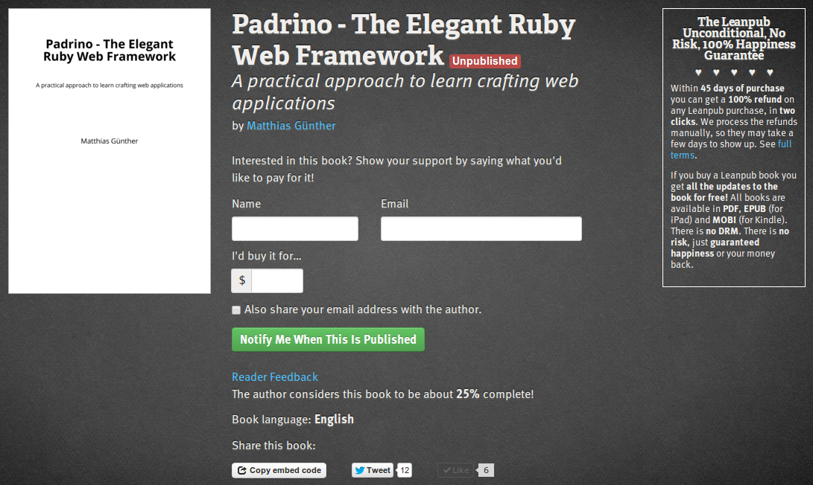
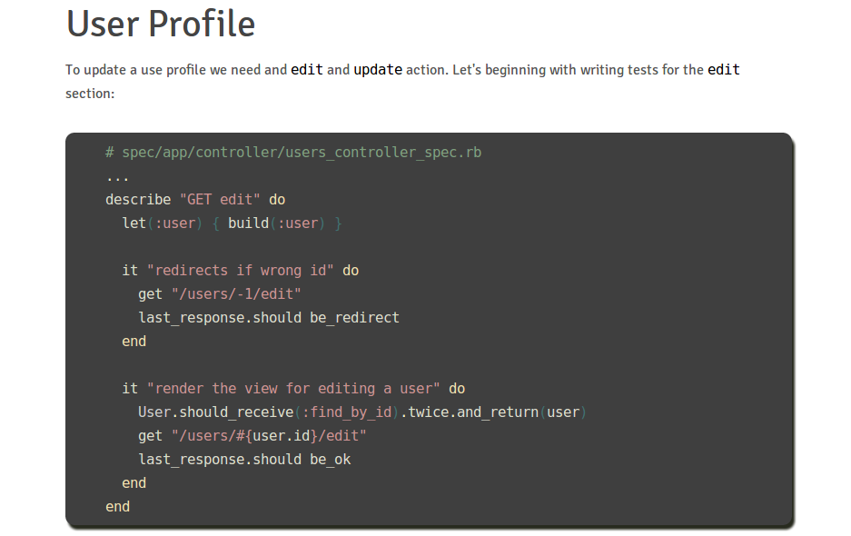
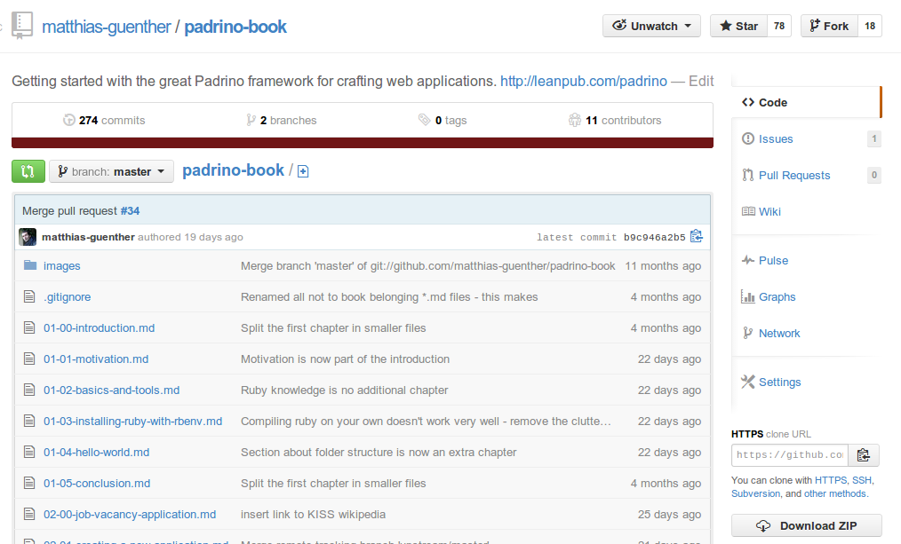
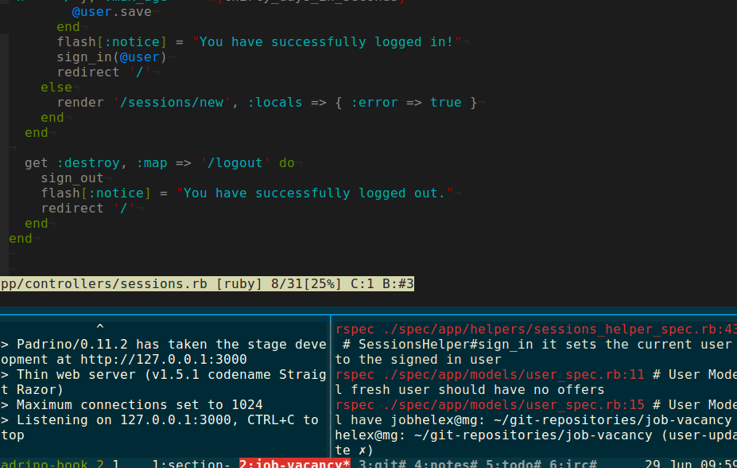

---
---

  

  

    If you want to go into web development with ease and no boundaries to which
    components you want to use, then dig into Padrino.
    Padrino is super interesting, but there aren't a lot of docs available and this book will change it.
  

  

    This book will teach you how to craft web applications in Padrino with joy and fun.
  

  

  

    
      <a href="/news">News</a>
    
    <ul>
      
        <li>
          <a href="{{ post.url }}">{{ post.title }}</a>
        </li>
      
    </ul>
    

      The person behind this book <a href="https://twitter.com/wikimatze">@wikimatze</a>:
    

    
  

  

    

      <h5>Stay informed with the newsletter:</h5>
      <link href="https://cdn-images.mailchimp.com/embedcode/slim-081711.css" rel="stylesheet" type="text/css">
      
      

      <form action="https://wikimatze.us6.list-manage.com/subscribe/post?u=4010f8ce18503766e176536f1&amp;id=198f8c0321" method="post" id="mc-embedded-subscribe-form" name="mc-embedded-subscribe-form" class="validate" target="_blank" novalidate>
        <input type="email" value="" name="EMAIL" class="email" id="mce-EMAIL" placeholder="email address" required>
        <input type="submit" value="Subscribe" name="subscribe" id="mc-embedded-subscribe" class="button pretty medium info btn">
      </form>
      

    

    

      <h5>Get the book:</h5>
      <a class="nice large button alert large secondary btn" style="text-decoration: none; margin-right: 10px" href="https://www.softcover.io/books/wikimatze/padrinobook#pricing">Buy</a>
      <a class="nice large button pretty large secondary btn" href="https://www.softcover.io/download/wikimatze/padrinobook/ebooks/padrinobook-preview.pdf">Preview</a>
      
 or <a href="/book">read online</a>.

    

  

<!--

  

    
      Recent commits
    
    

  

 
-->

<!--End mc_embed_signup-->

<!--

  

    <ul class="slides">
      <li>
        
      </li>
      <li>
        
      </li>
      <li>
        
      </li>
      <li>
        
      </li>
    </ul>
  

-->
  

